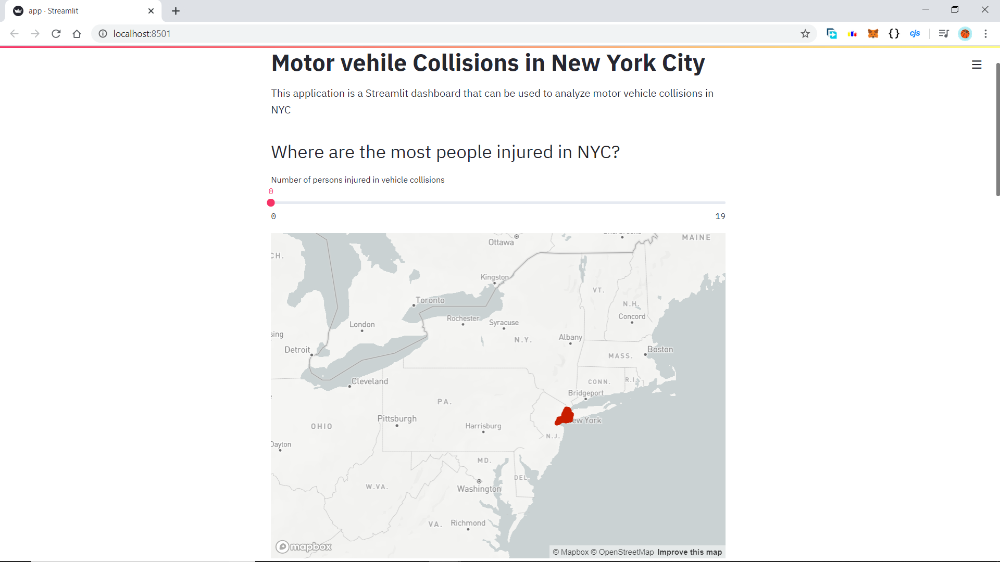
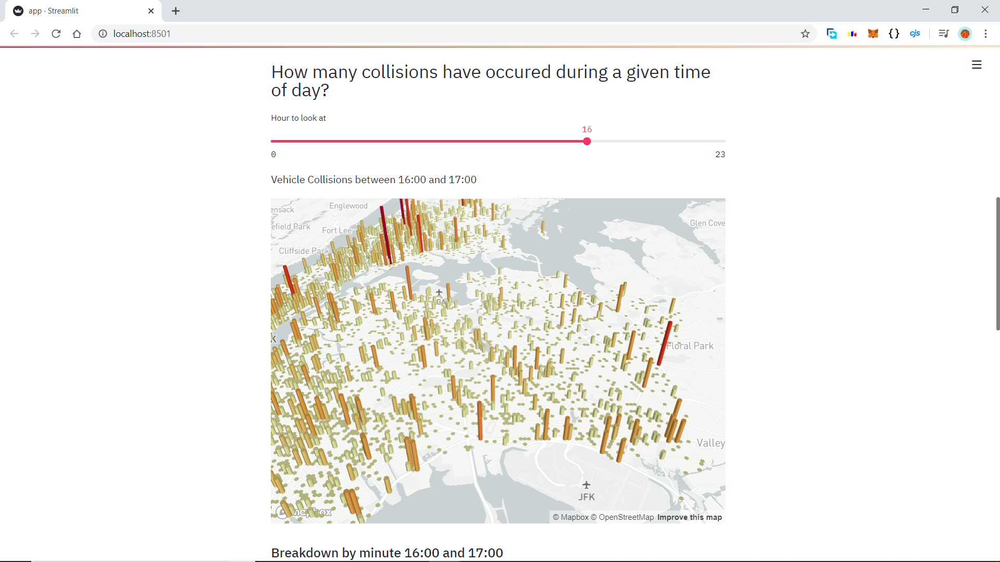
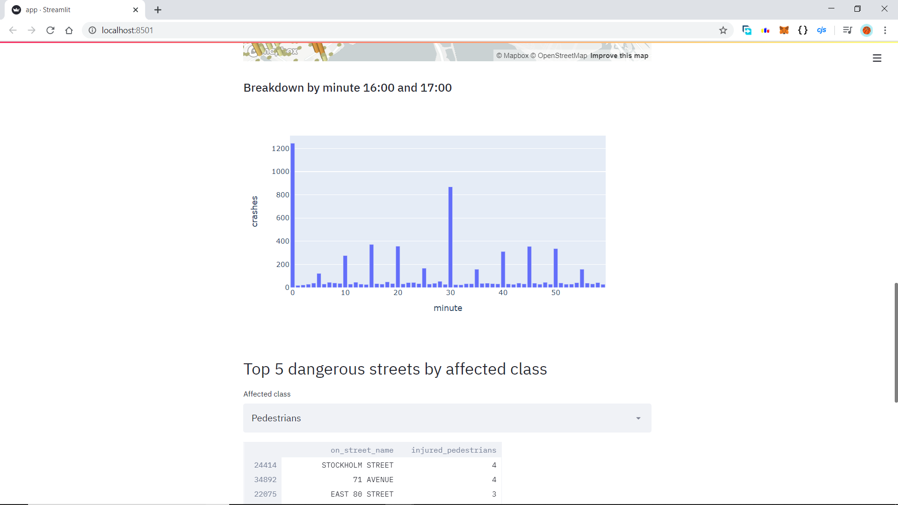
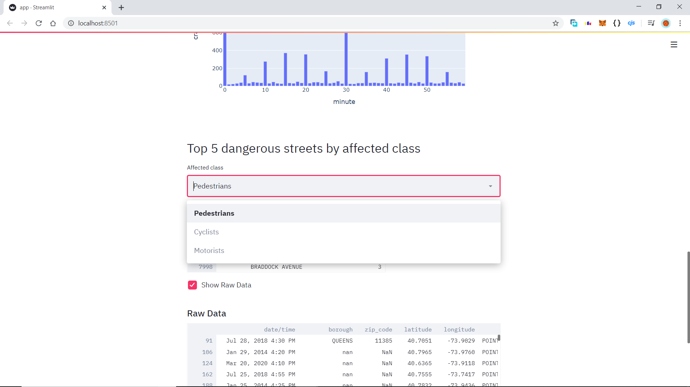
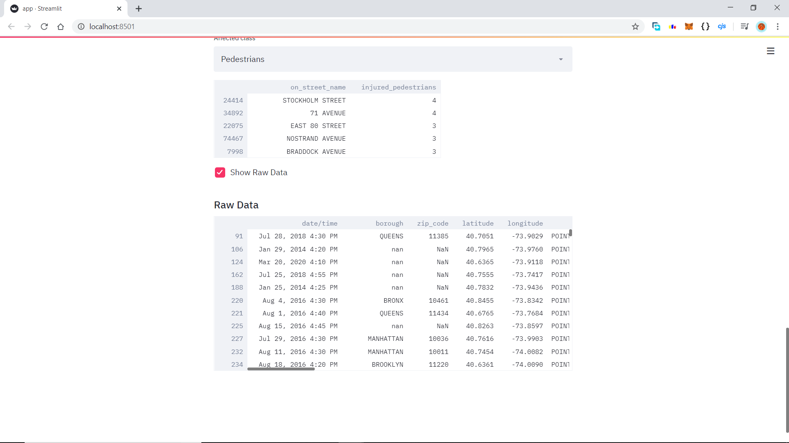

# Data_Science_Web_App

This is a web based application that uses a data set based on the details of :-

1. No. of accidents.

2. Date and Time Specifications.

3. No. of casualties.

4. No. of injured pedestrians,cyclists, and motorists.

5. Location co-ordinates.

and many other useful information about New York City.

The dataset can be found in the given link :-

<a href="https://drive.google.com/file/d/1RcdG5eiWUuLJCg4GNLElHgd6K0Zj1k5x/view?usp=sharing">Data-Set</a>

 ## For making the application web-based following functionalities have been used:-

1. `streamlit`.

2. `Pyplot.Express`.

## The Visualization of the data has been done by the following means :-

1. Located the spot of accidents using `streamlit.map`.

2. Visualized no. of accidents in a given time of day using `pydeck.Deck` and `pydeck.Layer`.

3. Visualized minute-wise breakdown within an hour-duration using `numpy.histogram`.

4. Categorised dangerous streets by name on the basis of the affected class (mainly, `Pedestrians`,`Cyclists`,and `Motorists`) using `st.selectbox` and `st.write(data.query())`.

5. Finally, visualized the raw data after cleaning and classifying the columns.

*Please don't forget to change the `DATA_URL` before taking the code for personal use*